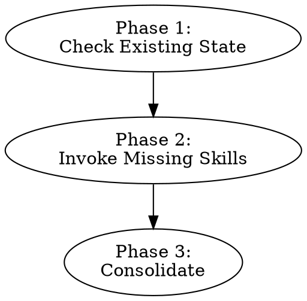

# Auditing I18n Readiness

Orchestrate a comprehensive i18n readiness audit by invoking the analysis skills and consolidating their findings. This skill does not perform analysis itself — it ensures all aspects of readiness are covered and produces a unified set of recommendations.

**Announce at start:** "I'm using the auditing-i18n-readiness skill to run a comprehensive i18n readiness audit."

## When to Use

- General "audit this codebase for i18n/l10n" requests
- Assessing overall readiness for localization
- Ensuring all audit dimensions (string patterns, tone, terminology) are covered
- Consolidating findings from multiple audit skills into actionable next steps

**Do not use for:** Running a single targeted analysis — use the specific skill instead:
- String patterns / scope / formatting → `auditing-i18n-string-patterns`
- Tone only → `auditing-i18n-tone`
- Terminology only → `auditing-i18n-terminology`

## Scope Constraint

When invoked as a command, arguments are treated as paths to analyze:

```
/auditing-i18n-readiness apps/web/src packages/components/src
```

If paths are provided, pass them to all invoked analysis skills so they limit scanning to those paths. If no paths are provided, all skills analyze the entire repository.

## Analysis Skills

| Skill | Purpose | Writes to |
|-------|---------|-----------|
| `auditing-i18n-string-patterns` | Discover all strings, analyze construction patterns, check formatting, assess scope | `i18n-pre-extraction-fixes.md` + `i18n-extraction-pattern-catalog.md` |
| `auditing-i18n-tone` | Assess brand/tone consistency, idioms, cultural risks | `i18n-pre-extraction-fixes.md` |
| `auditing-i18n-terminology` | Check vocabulary consistency, build proto-glossary | `i18n-pre-extraction-fixes.md` |

## Process



### Phase 1: Check Existing State

Examine `i18n-pre-extraction-fixes.md` and `i18n-extraction-pattern-catalog.md` to determine which skills have already run. Look for these section markers:

| Section present | Skill has run |
|----------------|---------------|
| "Tech Stack & Configuration" or "Scope Assessment" or extraction pattern catalog file exists | `auditing-i18n-string-patterns` |
| "Tone & Brand Analysis" | `auditing-i18n-tone` |
| "Terminology Consistency" | `auditing-i18n-terminology` |

### Phase 2: Invoke Missing Skills

Invoke any skills that haven't already run, in this order:

1. **`auditing-i18n-string-patterns`** (first, if missing) — produces the tech stack, string inventory, and scope metrics that other skills consume
2. **`auditing-i18n-tone`** and **`auditing-i18n-terminology`** (after string-patterns) — these are independent and can be invoked in parallel

If all skills have already run, skip to Phase 3.

### Phase 3: Consolidate

After all analysis skills have completed:

1. **Read all sections** of `i18n-pre-extraction-fixes.md` written by the analysis skills
2. **Consolidate Recommended Next Steps** — deduplicate across all skills, order by priority, and ensure clear separation between:
   - **Pre-extraction action items** (formatting fixes, tone fixes, terminology standardization) with effort estimates
   - **Extraction guidance** (pointers to the pattern catalog and key gotchas)
3. **Offer to create implementation plans** in parallel for all actionable pre-extraction items
4. Write the consolidated Recommended Next Steps section to `i18n-pre-extraction-fixes.md`

## Common Mistakes

- **Doing analysis directly:** This skill orchestrates — it doesn't analyze code. If you find yourself scanning for string patterns or reading source files, you should be invoking `auditing-i18n-string-patterns` instead.
- **Skipping skills the user didn't mention:** A general readiness audit covers all dimensions. Invoke all missing skills unless the user explicitly scoped the request.
- **Running skills that already completed:** Check for existing sections before invoking. Re-running wastes time and may overwrite previous findings.
- **Forgetting to consolidate:** The consolidation pass is the value this skill adds. Without it, the user gets disconnected recommendation lists instead of a prioritized action plan.
