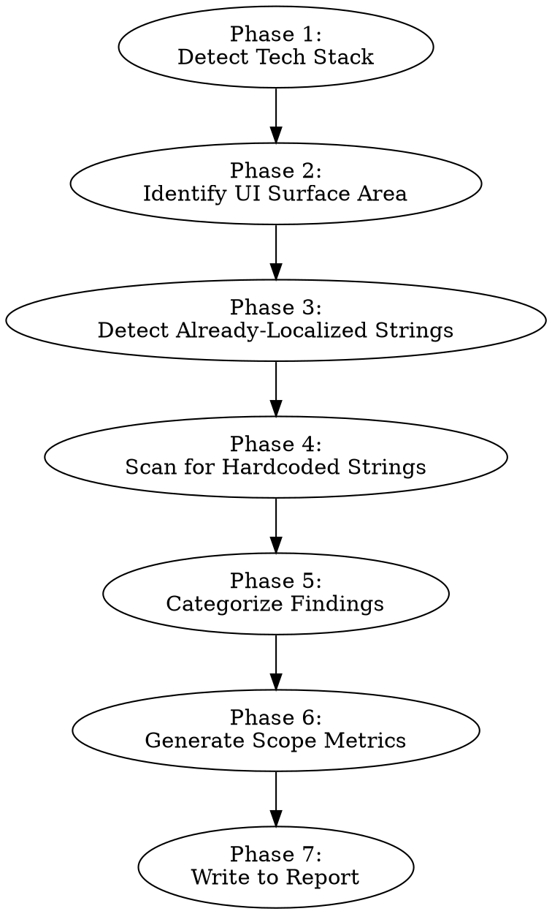

# Auditing I18n Scope

Discover all hardcoded copy in a codebase, detect already-localized strings, and assess the overall scale of localization work.

**Announce at start:** "I'm using the auditing-i18n-scope skill to assess the localization scope of this codebase."

## When to Use

- Starting a localization initiative and need to know the scale of work
- Assessing how much hardcoded copy exists before string extraction
- Checking what percentage of strings are already localized
- Generating a string inventory for downstream analysis (readiness, tone, terminology)

**Do not use for:** Extracting strings into i18n files, fixing localization issues, or analyzing tone/terminology (use the dedicated skills for those).

## Process

Follow these phases in order. Write findings to `i18n-audit-report.md` in the repo root. If the file already exists, replace the "Tech Stack & Configuration" and "Scope Assessment" sections while preserving other sections.

### Phase 1: Detect Tech Stack

Identify the project's technology:
- **Languages:** TypeScript, JavaScript, Swift, Kotlin, Java, Objective-C, Dart, etc.
- **Frameworks:** React, Vue, Angular, Svelte, SwiftUI, UIKit, Jetpack Compose, Flutter, etc.
- **Templating:** JSX, HTML templates, Storyboards, XIBs, XML layouts, etc.
- **Existing i18n:** Look for i18next, react-intl, vue-i18n, angular/localize, NSLocalizedString usage, strings.xml, .strings files, .arb files, or any i18n library in dependencies

Write tech stack findings to the report immediately — downstream skills depend on this.

### Phase 2: Identify UI Surface Area

Find all files that render user-facing content. Exclude test files, build output, node_modules, Pods, generated code.

| Stack | UI files to scan |
|-------|-----------------|
| React/Next | `.tsx`, `.jsx` files with JSX returns |
| Vue | `.vue` SFCs, especially `<template>` blocks |
| Angular | `.html` templates, `.ts` components with `template:` |
| Svelte | `.svelte` files |
| Swift (UIKit) | `.swift` files referencing `UILabel`, `UIButton`, `.text =`, Storyboard/XIB files |
| Swift (SwiftUI) | `.swift` files with `Text()`, `Label()`, `Button()` |
| Kotlin/Java (Android) | XML layouts (`res/layout/`), Compose files with `Text()`, `Button()` |
| Flutter | `.dart` files with `Text()`, `AppBar(title:)` |

Record the total file count — this bounds the search.

### Phase 3: Detect Already-Localized Strings

Scan for strings that are already going through an i18n system:

| Pattern | Framework |
|---------|-----------|
| `t('key')`, `t("key")` | i18next, react-i18next |
| `intl.formatMessage(...)` | react-intl |
| `$t('key')` | vue-i18n |
| `{{ 'key' \| translate }}` | Angular |
| `NSLocalizedString(...)` | iOS (ObjC/Swift) |
| `String(localized:)` | iOS (Swift 5.7+) |
| `getString(R.string.x)` | Android (Java/Kotlin) |
| `stringResource(R.string.x)` | Jetpack Compose |
| `AppLocalizations.of(context)` | Flutter |

Count these as "already localized." They represent work already done.

### Phase 4: Scan for Hardcoded Strings

Within the UI surface area, find string literals that appear to be user-facing copy. This is the core of the audit.

**What to find:**
- Text content rendered to users (labels, headings, body text, buttons)
- Placeholder text, tooltip text, title attributes
- Error messages and validation messages shown to users
- Accessibility text (aria-labels, alt text, contentDescription)

**What to filter out (not user-facing):**
- Log messages (`console.log`, `print`, `Log.d`)
- CSS class names, style values
- Route paths, URLs, API endpoints
- Event names, action types, Redux actions
- Configuration keys, environment variable names
- Import paths, file paths
- Test assertions, test data
- Comments and documentation strings
- Enum values and constant identifiers

**Stack-specific heuristics:**

**JSX/TSX:**
- Text between JSX tags: `<h1>Dashboard</h1>`, `
Welcome back
`
- String props: `placeholder="Search..."`, `aria-label="Close"`, `title="Settings"`
- Ternary/conditional text: `{isNew ? "Create" : "Update"}`

**Vue templates:**
- Text between tags outside `{{ }}` interpolation
- Attribute bindings with string literals: `:placeholder="'Search...'"`
- `v-text` directives with string literals

**Swift:**
- String literals assigned to `.text`, `.title`, `.placeholder`
- String arguments to `Text()`, `Label()`, `Button()` in SwiftUI
- Strings in `.alert()`, `.confirmationDialog()`, `.navigationTitle()`

**Kotlin/Android:**
- XML: `android:text="..."`, `android:hint="..."`, `android:contentDescription="..."`
- Compose: string arguments to `Text()`, `Button()`, `TextField(placeholder = ...)`

**Confidence levels:**
- **High:** String literal directly rendered in UI context (e.g., JSX text content, `android:text=`)
- **Medium:** String in a variable/constant that is likely rendered but assignment isn't directly in UI code
- **Low:** String that could be user-facing but context is ambiguous

### Phase 5: Categorize Findings

Group every discovered string:

**By type:**
| Type | Examples |
|------|---------|
| Button/action labels | "Save", "Cancel", "Delete" |
| Headings | "Dashboard", "Settings", "Profile" |
| Body text | "Welcome back! Here's your summary." |
| Error messages | "Something went wrong. Please try again." |
| Placeholders | "Search...", "Enter your email" |
| Tooltips | "Click to expand", "Copy to clipboard" |
| A11y text | aria-labels, alt text, contentDescription |
| Status text | "Loading...", "No results found" |

**By location:** file path, component/view name, screen/feature area (inferred from directory structure).

**By confidence:** high, medium, low.

### Phase 6: Generate Scope Metrics

Produce a quantitative summary:
- Total user-facing string count (localized + hardcoded)
- Already-localized count and percentage
- Hardcoded count broken down by confidence level
- File count with hardcoded strings
- Top 10 files by string density (heatmap)
- Breakdown by string type (table)
- Breakdown by feature area if directory structure allows

### Phase 7: Write to Report

Create or update `i18n-audit-report.md` with:

1. **Tech Stack & Configuration** section (from Phase 1)
2. **Scope Assessment** section containing:
   - Summary line (e.g., "847 hardcoded strings across 62 files. 23 strings already localized (3%).")
   - Metrics table
   - String density heatmap (top files)
   - Type breakdown table
   - Feature area breakdown (if available)
3. Initial entries in **Recommended Next Steps** section

If this is the first skill to run, create the full report skeleton with placeholder sections for Readiness Issues, Tone & Brand Analysis, and Terminology Consistency.

## Quick Reference

| Phase | Key action | Output |
|-------|-----------|--------|
| 1. Tech stack | Check deps, file types, existing i18n | Tech stack section in report |
| 2. UI surface | Find all UI-rendering files | File list (search perimeter) |
| 3. Localized | Find i18n library usage | "Already done" count |
| 4. Hardcoded | Scan for string literals in UI code | String inventory |
| 5. Categorize | Group by type, location, confidence | Categorized inventory |
| 6. Metrics | Count, rank, break down | Quantitative summary |
| 7. Report | Write to i18n-audit-report.md | Committed report section |

## Common Mistakes

- **Including non-user-facing strings:** Log messages, debug output, and configuration keys inflate the count and waste downstream analysis time. When in doubt, mark as low confidence rather than including at high confidence.
- **Missing accessibility text:** `aria-label`, `alt`, `contentDescription` are user-facing (screen readers read them aloud). Always include them.
- **Ignoring existing localization:** If 40% of strings are already localized, that dramatically changes the scope. Always check for existing i18n setup first.
- **Counting duplicates:** The same string appearing in 10 files is 10 extraction points but only 1 translation. Note both counts (occurrences vs. unique strings).
