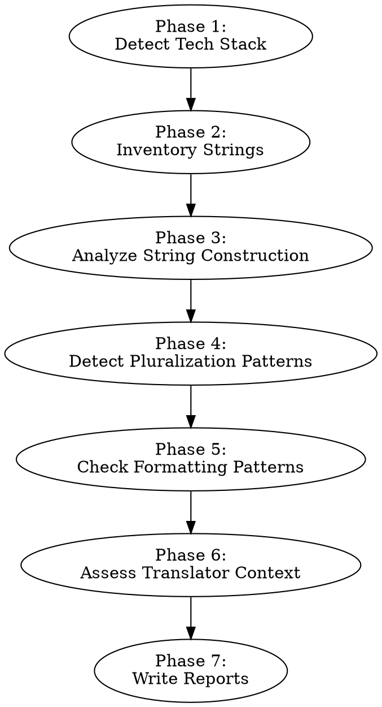

# Auditing I18n String Patterns

Discover all user-facing strings in a codebase, analyze how they're constructed, and assess locale-sensitive formatting. This skill produces:

1. **Scope metrics and tech stack** (written to `i18n-pre-extraction-fixes.md`) — quantitative inventory of all strings, localization coverage, and density heatmap.
2. **Pre-extraction formatting fixes** (written to `i18n-pre-extraction-fixes.md`) — hardcoded date/number/currency formatting that should be centralized behind locale-aware APIs before extraction.
3. **Extraction pattern catalog** (written to `i18n-extraction-pattern-catalog.md`) — an inventory of string construction techniques with locations, conversion recipes, and gotchas for the extraction step.

**Announce at start:** "I'm using the auditing-i18n-string-patterns skill to inventory strings and analyze construction patterns."

## Categorization Framework

Not every localization issue needs to be "fixed" before extraction. The key question is: **does fixing this produce value independent of extraction, or is the fix inseparable from extraction itself?**

### Pre-Extraction Fix (fix now)

A finding belongs here if:
- The fix is **library-agnostic** — it improves code quality regardless of which i18n library is chosen
- The fix **reduces surface area** the extraction agent must reason about
- The fix is a **bug** independent of i18n concerns
- The pattern involves **formatting APIs** (dates, numbers, currency) that should be centralized behind locale-aware wrappers

Examples: Hardcoded `'en-US'` in `toLocaleString` calls, date formatting utilities using hardcoded format strings, currency symbols hardcoded in JSX, bugs found during the audit.

### Extraction Pattern (catalog for extraction)

A finding belongs here if:
- **The fix IS the extraction** — restructuring to an intermediate form would be throwaway work
- The extraction step directly converts the pattern to ICU message format in one step
- There is no useful intermediate representation between the current code and the i18n version

Examples: Template literals building sentences, ternary text switching, pluralization utilities and ternary plurals (replaced by ICU `{count, plural, ...}`), title/placeholder/aria-label attributes.

### Edge Cases

Some string construction is **so tangled** (multi-line assembly, conditional logic spanning functions) that simplifying the code logic first — without any i18n changes — would meaningfully reduce extraction risk. These are pre-extraction fixes even though they involve strings, because the value is in simplifying the code, not in doing partial i18n work. The bar for this is high — most concatenation, even if messy, is better handled in one step during extraction.

## When to Use

- Starting a localization initiative and need to know the scale of work
- Analyzing what string patterns exist and how extraction should handle them
- Identifying formatting issues to fix before extraction
- Building a pattern catalog that guides extraction tooling
- Assessing how much hardcoded copy exists before string extraction

**Do not use for:** Analyzing tone (use auditing-i18n-tone), checking terminology consistency (use auditing-i18n-terminology), or running a full readiness audit (use auditing-i18n-readiness, which orchestrates all skills including this one).

## Scope Constraint

When invoked as a command, arguments are treated as paths to analyze:

```
/auditing-i18n-string-patterns apps/web/src packages/components/src
```

If no paths are provided, analyze the entire repository (excluding test files, build output, node_modules, and other non-source directories).

Note the analyzed paths in the report header so readers know the audit's scope:
- **Scope:** `apps/web/src/`, `packages/components/src/` — or —
- **Scope:** Entire repository

## Process

Follow these phases in order. Write scope metrics and pre-extraction fixes to `i18n-pre-extraction-fixes.md` and extraction patterns to `i18n-extraction-pattern-catalog.md`. Create either file if it does not exist.



### Phase 1: Detect Tech Stack

Identify the project's technology:
- **Languages:** TypeScript, JavaScript, Swift, Kotlin, Java, Objective-C, Dart, etc.
- **Frameworks:** React, Vue, Angular, Svelte, SwiftUI, UIKit, Jetpack Compose, Flutter, etc.
- **Templating:** JSX, HTML templates, Storyboards, XIBs, XML layouts, etc.
- **Existing i18n:** Look for i18next, react-intl, vue-i18n, angular/localize, NSLocalizedString usage, strings.xml, .strings files, .arb files, or any i18n library in dependencies

Write tech stack findings to the report immediately — downstream skills depend on this.

### Phase 2: Inventory Strings

Find all user-facing strings in the codebase. This phase combines string discovery, non-code content scanning, and categorization into a single pass.

#### 2a. Identify UI Surface Area

Find all files that render user-facing content. Exclude test files, build output, node_modules, Pods, generated code.

| Stack | UI files to scan |
|-------|-----------------|
| React/Next | `.tsx`, `.jsx` files with JSX returns |
| Vue | `.vue` SFCs, especially `<template>` blocks |
| Angular | `.html` templates, `.ts` components with `template:` |
| Svelte | `.svelte` files |
| Swift (UIKit) | `.swift` files referencing `UILabel`, `UIButton`, `.text =`, Storyboard/XIB files |
| Swift (SwiftUI) | `.swift` files with `Text()`, `Label()`, `Button()` |
| Kotlin/Java (Android) | XML layouts (`res/layout/`), Compose files with `Text()`, `Button()` |
| Flutter | `.dart` files with `Text()`, `AppBar(title:)` |

Record the total file count — this bounds the search.

#### 2b. Detect Already-Localized Strings

Scan for strings already going through an i18n system:

| Pattern | Framework |
|---------|-----------|
| `t('key')`, `t("key")` | i18next, react-i18next |
| `intl.formatMessage(...)` | react-intl |
| `$t('key')` | vue-i18n |
| `{{ 'key' \| translate }}` | Angular |
| `NSLocalizedString(...)` | iOS (ObjC/Swift) |
| `String(localized:)` | iOS (Swift 5.7+) |
| `getString(R.string.x)` | Android (Java/Kotlin) |
| `stringResource(R.string.x)` | Jetpack Compose |
| `AppLocalizations.of(context)` | Flutter |

Count these as "already localized."

#### 2c. Scan for Hardcoded Strings

Within the UI surface area, find string literals that appear to be user-facing copy.

**What to find:**
- Text content rendered to users (labels, headings, body text, buttons)
- Placeholder text, tooltip text, title attributes
- Error messages and validation messages shown to users
- Accessibility text (aria-labels, alt text, contentDescription)
- CSS `content: "..."` in stylesheets (::before, ::after pseudo-elements)
- SVGs with `<text>` elements containing hardcoded strings
- Images with embedded text (require asset variants per locale)
- Email templates, push notifications, in-app messages

**What to filter out (not user-facing):**
- Log messages (`console.log`, `print`, `Log.d`)
- CSS class names, style values
- Route paths, URLs, API endpoints
- Event names, action types, Redux actions
- Configuration keys, environment variable names
- Import paths, file paths
- Test assertions, test data
- Comments and documentation strings
- Enum values and constant identifiers

**Stack-specific heuristics:**

**JSX/TSX:**
- Text between JSX tags: `<h1>Dashboard</h1>`, `<p>Welcome back</p>`
- String props: `placeholder="Search..."`, `aria-label="Close"`, `title="Settings"`
- Ternary/conditional text: `{isNew ? "Create" : "Update"}`

**Vue templates:**
- Text between tags outside `{{ }}` interpolation
- Attribute bindings with string literals: `:placeholder="'Search...'"`
- `v-text` directives with string literals

**Swift:**
- String literals assigned to `.text`, `.title`, `.placeholder`
- String arguments to `Text()`, `Label()`, `Button()` in SwiftUI
- Strings in `.alert()`, `.confirmationDialog()`, `.navigationTitle()`

**Kotlin/Android:**
- XML: `android:text="..."`, `android:hint="..."`, `android:contentDescription="..."`
- Compose: string arguments to `Text()`, `Button()`, `TextField(placeholder = ...)`

**Confidence levels:**
- **High:** String literal directly rendered in UI context (e.g., JSX text content, `android:text=`)
- **Medium:** String in a variable/constant that is likely rendered but assignment isn't directly in UI code
- **Low:** String that could be user-facing but context is ambiguous

#### 2d. Categorize Findings

Group every discovered string:

**By type:**
| Type | Examples |
|------|---------|
| Button/action labels | "Save", "Cancel", "Delete" |
| Headings | "Dashboard", "Settings", "Profile" |
| Body text | "Welcome back! Here's your summary." |
| Error messages | "Something went wrong. Please try again." |
| Placeholders | "Search...", "Enter your email" |
| Tooltips | "Click to expand", "Copy to clipboard" |
| A11y text | aria-labels, alt text, contentDescription |
| Status text | "Loading...", "No results found" |
| CSS content | `content: "..."` pseudo-element text |

**By location:** file path, component/view name, screen/feature area (inferred from directory structure).

**By confidence:** high, medium, low.

**By string construction technique:**
Note the string management techniques observed during scanning:
- Are strings mostly inline literals, template literals with interpolation, or concatenated from parts?
- Are there utility functions for string construction (e.g., `pluralize()`, format helpers)?
- Are there patterns like ternary text switching inside JSX or conditional string assembly?
- Are there centralized string constant files, or is everything scattered inline?

### Phase 3: Analyze String Construction

Scan for patterns that break when translated. Different languages have different word order, grammatical gender, and sentence structure.

**These findings go in `i18n-extraction-pattern-catalog.md`** — the extraction step converts them directly to ICU message format. There is no useful intermediate form.

**Exception:** If a string construction pattern is genuinely tangled (multi-line assembly across variables, conditional logic spanning functions, fragments assembled across files), and simplifying the *code logic* would meaningfully reduce extraction risk, categorize it as a pre-extraction fix.

**Concatenation:**
```
// PROBLEM: word order differs across languages
"Hello, " + userName + "! You have " + count + " new messages."

// Extraction converts to: t('welcome', { userName, count })
// ICU: "Hello, {userName}! You have {count} new messages."
// German reorders: "Hallo, {userName}! Sie haben {count} neue Nachrichten."
// Japanese restructures: "{userName}さん、こんにちは！新しいメッセージが{count}件あります。"
```
Find: `+` operators joining string literals with variables, template literals building sentences from parts, `String.format` with sentence fragments.

**Interpolation with embedded logic:**
```
// PROBLEM: ternary inside template switches text fragments
`Sign ${userHasAccount ? 'in' : 'up'} with code`

// Extraction creates two separate message IDs:
// t('auth.signInWithCode') → "Sign in with code"
// t('auth.signUpWithCode') → "Sign up with code"
```
Find: ternary operators inside strings that switch text.

**Sentence fragments:**
```
// PROBLEM: assembling sentences from separate strings/variables
const greeting = getGreeting();  // "Good morning"
const message = greeting + ", " + userName;  // Can't reorder

// Extraction creates a single message with all context:
// t('greeting', { timeOfDay, userName }) → "{timeOfDay}, {userName}"
```
Find: variables holding partial sentences that get assembled elsewhere.

**Category/select switching:**
```
// PROBLEM: conditional rendering based on gender, role, status, etc.
{user.role === 'admin' ? 'Administrator' : user.role === 'editor' ? 'Editor' : 'Viewer'}

// Extraction converts to ICU select:
// t('user.roleLabel', { role }) → "{role, select, admin {Administrator} editor {Editor} other {Viewer}}"

// Gender example:
{gender === 'male' ? 'He updated his profile' : gender === 'female' ? 'She updated her profile' : 'They updated their profile'}
// → "{gender, select, male {He updated his profile} female {She updated her profile} other {They updated their profile}}"
```
Find: switch statements, chained ternaries, or if/else chains that select between text variants based on a category value (not a count — count-based switching is pluralization). Look for conditionals on variables like `gender`, `role`, `status`, `type`, `kind`.

For each pattern found, record:
- The **technique** (concatenation, template literal, ternary switch, fragment assembly, category select)
- **Location** (file, line)
- **Example** (the actual code)
- **Conversion note** (how extraction should handle it — separate messages, ICU placeholders, etc.)
- **Gotchas** (e.g., "ternary switches a single word mid-sentence — need two complete separate messages, not one message with a placeholder for the differing word")

### Phase 4: Detect Pluralization Patterns

How does the app handle plural forms today? **All pluralization findings go in `i18n-extraction-pattern-catalog.md`** — the extraction step replaces them with ICU plural syntax. There is no value in standardizing English-only pluralization before extraction.

| Pattern | Assessment | Extraction Conversion |
|---------|------------|----------------------|
| `count === 1 ? "item" : "items"` | English-only, handles 2 forms. Arabic needs 6, Polish needs 4. | `{count, plural, one {# item} other {# items}}` |
| Custom `pluralize()` utility | English-only. Check for exceptions map with irregular plurals. | Delete utility. Use ICU plural at each call site. Preserve irregular forms from exceptions map. |
| `if (count === 0) ... else if (count === 1) ... else ...` | Handles zero/one/other but misses many languages. | `{count, plural, zero {...} one {...} other {...}}` |
| Verb conjugation tied to count (`has/have`, `is/are`) | Both noun and verb must be inside the plural block. | `{count, plural, one {# row has} other {# rows have}}` |
| Count variable adjacent to noun without branching (`"Archive {count} chats"`, `` `${count} items in cart` ``) | Code doesn't branch but the noun is inherently plural-sensitive. Easy to miss because there's no conditional. | `{count, plural, one {Archive # chat} other {Archive # chats}}` |
| Using `Intl.PluralRules` or equivalent | Language-aware — good existing pattern. | May already be compatible with i18n library. |
| Using i18n library pluralization (ICU `{count, plural, ...}`) | Already correct. | No change needed. |

For each pattern found, record the technique, count of occurrences, example locations, and the conversion recipe — including gotchas (e.g., "utility has an exceptions map for irregular plurals — check the map and preserve irregular forms in ICU messages").

### Phase 5: Check Formatting Patterns

Scan for hardcoded locale-sensitive formatting. **These findings go in `i18n-pre-extraction-fixes.md`** — centralizing formatting behind locale-aware APIs is independent of string extraction and should be done first.

**Why pre-extraction:** Formatting APIs (`Intl.DateTimeFormat`, `Intl.NumberFormat`) accept a locale parameter. Making them locale-aware is a code quality improvement that works regardless of which i18n library is chosen for strings. Doing it first means the extraction agent doesn't need to reason about formatting concerns — it only handles strings.

**Dates:**
- Hardcoded format strings: `MM/DD/YYYY`, `DD.MM.YYYY`
- `toLocaleDateString()` without explicit locale argument (uses system locale — inconsistent)
- `new Date().toISOString()` displayed to users (technical format)
- `DateFormatter` (Swift) or `SimpleDateFormat` (Java/Kotlin) with hardcoded patterns
- Date formatting utilities wrapping libraries (e.g., date-fns) with hardcoded English format strings

**Numbers:**
- `toFixed(2)` for currency display (decimal separator varies by locale)
- Manual comma/period insertion for thousands separators
- Hardcoded decimal separators
- `toLocaleString('en-US')` or other hardcoded locale

**Currency:**
- Hardcoded symbols: `$`, `EUR`, `USD` prepended/appended to amounts
- Symbol position varies by locale (`$10` vs `10 $` vs `10$`)
- `Intl.NumberFormat` with hardcoded locale or currency

**Measurements:**
- Hardcoded unit labels: "kg", "miles", "inches"

Rate each as:
- **Blocker:** User sees wrong format for their locale (hardcoded `en-US`, hardcoded `$`)
- **Warning:** Inconsistent but functional (missing locale arg defaults to system locale)

### Phase 6: Assess Translator Context

Evaluate whether translators will be able to produce good translations from extracted strings.

**Ambiguous strings** — these feed both pre-extraction glossary work and extraction-time descriptions:
- Short strings with multiple meanings: "Post" (verb: submit / noun: article), "Set" (verb: configure / noun: collection), "Save" (verb: store / noun: discount)
- Strings that need grammatical context: "New" (masculine? feminine? neuter? depends on language)
- **Pre-extraction action:** Feed ambiguous terms into the terminology skill's glossary. Resolve which meaning applies in each usage context before extraction begins.
- **Extraction action:** Each extracted message should include a `description` or `context` field for translators explaining the meaning in context.

**Variable context:**
- Strings with placeholders where the variable's type/meaning isn't obvious: `"Updated {0} ago"` — is `{0}` a time duration? A date? A name?
- Strings where the variable affects grammar: `"Delete {name}?"` — in German, the article before `{name}` depends on the noun's gender

**String organization assessment:**
- Are strings in constant files, inline, or mixed?
- Is there any existing centralization the extraction should preserve or build on?
- What naming convention should extraction keys follow? (If the terminology skill has run, reference its glossary for semantic key naming.)

**Product names and untranslatable terms:**
- Identify brand names, feature names, and technical terms that should NOT be translated
- These need to be listed so the extraction agent preserves them as-is and adds translator notes marking them as non-translatable

### Phase 7: Write Reports

Write to two files:

#### `i18n-pre-extraction-fixes.md`

Create or update with:

1. **Tech Stack & Configuration** (from Phase 1)
2. **Scope Assessment:**
   - Summary line (e.g., "847 hardcoded strings across 62 files. 23 strings already localized (3%).")
   - Metrics: total strings, localized vs hardcoded, confidence breakdown, file count
   - String density heatmap (top 10 files by string count)
   - Breakdown by string type
   - Breakdown by feature area (if discernible from directory structure)
   - String construction techniques observed
3. **Pre-Extraction Fixes** — formatting and structural issues:

| Category | Severity | Count | Example | Remediation |
|----------|----------|-------|---------|-------------|
| Hardcoded date formats | Blocker | 19 | `Occasion.ts:62` — `'h:mm a'` | Centralize through `Intl.DateTimeFormat` with locale param |
| Hardcoded locale in API calls | Blocker | 5 | `Contact.ts:93` — `toLocaleString('default')` | Pass explicit locale parameter |
| Hardcoded currency | Blocker | 7 | `aura.ts:54` — `'$0'` | Use `Intl.NumberFormat` with locale-aware currency |

   Include effort estimates per category: small (< 1 day), medium (1-3 days), large (3+ days).

4. **Bugs found during audit** that should be fixed before extraction
5. Contribute items to **Recommended Next Steps**

If this is the first skill to run, create the full report skeleton with placeholder sections for Tone & Brand Analysis and Terminology Consistency.

#### `i18n-extraction-pattern-catalog.md`

Create or replace with the full pattern catalog:

1. **Summary:** Total extraction patterns cataloged, breakdown by technique type

2. **Pattern entries** — for each technique type found:

```markdown
### [Pattern Name] — [count] instances

**Technique:** [how the code constructs/manages the string]
**Conversion:** [how extraction should transform this to i18n format]
**Gotchas:** [edge cases, things that could go wrong, non-obvious details]

| File | Line | Example |
|------|------|---------|
| ... | ... | ... |
```

Pattern types to catalog (as applicable):
- Template literal sentences
- Ternary text switching (including mid-sentence word switches)
- Category/select switching (gender, role, status, type)
- Sentence fragment assembly
- Pluralization utility functions and their call sites
- Ternary plural expressions
- Verb conjugation tied to count
- Title/placeholder attributes
- Aria-label/alt text attributes
- Confirmation dialog strings
- CSS content strings
- SVG text elements

3. **Cross-cutting gotchas:** Patterns that span multiple technique types or require special attention. Always include:
   - **Wiring interpolation values through:** Every `{placeholder}` in a catalog entry must have a corresponding values argument at the call site. This is especially easy to miss when i18n keys are stored as data (config objects, arrays, preference definitions) rather than called inline — the data structure needs a field for interpolation values, and the renderer must forward them. Flag any patterns where keys-as-data are likely.
   - **ICU escaping:** Literal curly braces in text must be escaped with single quotes (`'{'` and `'}'`). A literal single quote is `''`. Flag any strings containing literal braces that will need escaping after extraction.
4. **Translator context notes:** Ambiguous strings, product names, variable context
5. **Recommended Next Steps** with extraction guidance, suggested ordering, and pointers to key patterns

## Quick Reference

| Phase | What to find | Output file |
|-------|-------------|------------|
| Tech stack | Languages, frameworks, existing i18n | `i18n-pre-extraction-fixes.md` |
| String inventory | All user-facing strings, already-localized, non-code content | `i18n-pre-extraction-fixes.md` (scope metrics) |
| String construction | Concatenation, fragments, embedded logic | `i18n-extraction-pattern-catalog.md` (unless genuinely tangled → `i18n-pre-extraction-fixes.md`) |
| Pluralization | Ternary plurals, utilities, verb conjugation | `i18n-extraction-pattern-catalog.md` |
| Formatting | Hardcoded dates, numbers, currency, units | `i18n-pre-extraction-fixes.md` |
| Translator context | Ambiguous strings, unclear variables, product names | Both (glossary items → pre-extraction, translator descriptions → catalog) |

## Common Mistakes

- **Including non-user-facing strings:** Log messages, debug output, and configuration keys inflate the count and waste downstream analysis time. When in doubt, mark as low confidence rather than including at high confidence.
- **Missing accessibility text:** `aria-label`, `alt`, `contentDescription` are user-facing (screen readers read them aloud). Always include them.
- **Ignoring existing localization:** If 40% of strings are already localized, that dramatically changes the scope. Always check for existing i18n setup first.
- **Counting duplicates:** The same string appearing in 10 files is 10 extraction points but only 1 translation. Note both counts (occurrences vs. unique strings).
- **Treating string patterns as pre-extraction fixes:** Template literals, ternary plurals, and concatenation are resolved BY extraction, not before it. Don't recommend restructuring them to an intermediate form — that's throwaway work. Catalog them for extraction instead.
- **Treating formatting as an extraction concern:** Date, number, and currency formatting centralization is independent of string extraction. These should be fixed first.
- **Missing the gotchas:** The catalog's value is in the details. "22 ternary plurals" is less useful than "22 ternary plurals, 5 of which also conjugate verbs — both noun and verb must be inside the ICU plural block."
- **Assuming English plural rules:** English has 2 forms (singular/plural). Arabic has 6. Polish has 4. Chinese has 1.
- **Missing CSS content:** `content: "..."` in pseudo-elements is invisible in typical string searches but visible to users.
- **Writing to wrong file:** Pre-extraction fixes and scope metrics go in `i18n-pre-extraction-fixes.md`. Extraction patterns go in `i18n-extraction-pattern-catalog.md`. Don't mix them.
