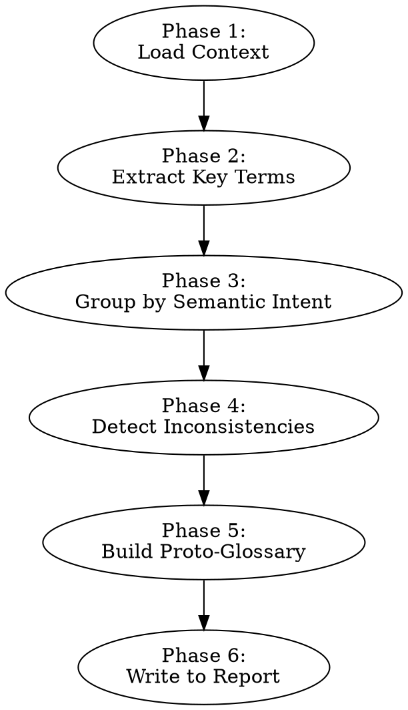

# Auditing I18n Terminology

Ensure a codebase's user-facing vocabulary is consistent — same concepts use the same words, labels are contextually distinct, and ambiguous terms are identified for translator guidance. Inconsistent terminology multiplies translation costs and confuses users.

Terminology standardization and glossary creation are **pre-extraction work** — they should be completed before string extraction so that extracted message keys use consistent naming, translators have context from day one, and ambiguous terms have been resolved in advance. These outputs are independent of i18n library choice.

**Announce at start:** "I'm using the auditing-i18n-terminology skill to analyze vocabulary consistency across this codebase's copy."

## When to Use

- Preparing for localization and need consistent source terminology before extraction
- Checking if the same concept is described with different words across the app
- Building a glossary for translators
- Identifying ambiguous terms that need context notes for translation

**Do not use for:** Scope/string pattern assessment (use auditing-i18n-string-patterns), tone analysis (use auditing-i18n-tone), or full readiness audit (use auditing-i18n-readiness).

## Scope Constraint

When invoked as a command, arguments are treated as paths to analyze:

```
/auditing-i18n-terminology apps/web/src packages/components/src
```

If no paths are provided, analyze the entire repository (excluding test files, build output, node_modules, and other non-source directories). Note the analyzed paths in the report header so readers know the audit's scope.

## Process

Follow these phases in order. Write findings to the "Terminology Consistency" section of `i18n-pre-extraction-fixes.md`. If the file already exists, replace the "Terminology Consistency" section while preserving other sections. If the file does not exist, create it with a report skeleton first, then populate your section.



### Phase 1: Load Context

- Read tech stack and string inventory from `i18n-pre-extraction-fixes.md` (written by auditing-i18n-string-patterns)
- If scope hasn't run, perform lightweight discovery — scan dependency files (package.json, Podfile, build.gradle) to detect the tech stack, then sample up to 20 UI-rendering files to build a working string inventory. This is not a complete inventory — just enough to proceed with terminology analysis.
- Note the app's domain (e.g., e-commerce, SaaS, social, finance) — domain shapes what terms matter most

### Phase 2: Extract Key Terms

Identify high-impact vocabulary from the string inventory. Focus on terms that users see frequently and that define the app's conceptual model.

**Action labels (highest priority):**
- Button text: "Save", "Submit", "Cancel", "Delete", "Remove", "Close"
- Menu items: "Edit", "Share", "Export", "Import"
- Link text: "Learn more", "See details", "View all"
- Destructive actions: "Delete", "Remove", "Discard", "Trash", "Clear"

**Navigation labels:**
- Tab names, section headers, sidebar items, breadcrumbs
- Page titles, screen names

**Status and state words:**
- Progress: "Loading", "Processing", "Uploading", "Syncing"
- Completion: "Done", "Complete", "Finished", "Success"
- Error: "Error", "Failed", "Unavailable", "Offline"
- State: "Active", "Inactive", "Enabled", "Disabled", "Pending", "Draft", "Published"

**Domain-specific nouns:**
- Core entities: What does the app call its primary objects? "Project" / "Workspace" / "Space" / "Board"?
- User roles: "Admin", "Owner", "Manager", "Member", "User"
- Features: How does the app name its features? Consistently?

**Common UI patterns:**
- Empty states: "No results", "Nothing here yet", "Get started by..."
- Confirmation dialogs: "Are you sure?", "This action cannot be undone"
- Authentication: "Sign in", "Log in", "Sign up", "Register", "Create account"

### Phase 3: Group by Semantic Intent

Cluster terms that convey the same meaning. This reveals where the app uses different words for the same concept.

**How to cluster:**
1. Start with action verbs — group all terms for the same user action
2. Then nouns — group all names for the same entity or concept
3. Then states — group all words for the same status

**Example clusters:**

| Semantic intent | Variants found |
|----------------|---------------|
| Destructive action | "Delete", "Remove", "Trash", "Discard", "Clear" |
| Save/persist | "Save", "Submit", "Apply", "Confirm", "Done" |
| Authentication entry | "Sign in", "Log in", "Login" |
| Cancel/dismiss | "Cancel", "Close", "Dismiss", "Go back", "Never mind" |
| Error state | "Error", "Failed", "Something went wrong", "Oops" |
| Empty state | "No results", "Nothing found", "No items yet", "It's empty" |

For each cluster, note the contexts where each variant appears (which screen, which component, what user action).

### Phase 4: Detect Inconsistencies

Flag three types of terminology problems:

**Same concept, different words (most common):**
- "Settings" in the navbar but "Preferences" in the footer
- "Delete" on one screen, "Remove" on another for the same action
- "Workspace" in docs but "Project" in the UI
- Severity: high if user-facing navigation, medium if contextual labels

**Same word, different meanings (important for translators):**
- "Post" as a noun (blog post) AND as a verb (submit/publish)
- "Save" as persist AND as discount/coupon
- "Check" as verify AND as payment instrument
- These MUST have translator context notes — without them, translators will guess wrong
- Severity: high (directly causes mistranslation)

**Unnecessary variation (cosmetic but cumulative):**
- "Sign in" / "Log in" / "Login" — pick one
- "e-mail" / "email" / "Email" / "E-mail" — pick one
- "OK" / "Ok" / "Okay" — pick one
- Severity: medium (inconsistent UX, multiplies translation effort)

### Phase 5: Build Proto-Glossary

For each semantic cluster from Phase 3, recommend a canonical term:

**Selection criteria:**
1. **Frequency:** The most commonly used variant has momentum — changing fewer instances is less work
2. **Clarity:** If the most frequent term is ambiguous, prefer the clearest one
3. **Platform convention:** iOS uses "Delete", Android uses "Remove" — match the platform if appropriate
4. **Brand alignment:** If brand guidelines specify terminology, follow them

**Proto-glossary entry format:**

| Term | Definition (in this app's context) | Context note for translators | Replaces |
|------|-----------------------------------|------------------------------|----------|
| Delete | Permanently remove an item | Destructive action; used for user content (posts, files). Not for removing team members (use "Remove" for people). | "Trash", "Discard" (in file context) |
| Save | Persist current state | Verb only — not used as noun (discount). Used on form submissions and document editing. | "Submit" (on non-form screens), "Apply" |
| Sign in | Authenticate to access account | NOT "Log in", "Login", or "Sign on". Used at all auth entry points. | "Log in", "Login" |

Include context notes for every term that is:
- Ambiguous (multiple possible meanings)
- Domain-specific (translators won't know the app's meaning)
- Short (1-2 words — translators need to know the grammatical context)

### Phase 6: Write to Report

Append the "Terminology Consistency" section to `i18n-pre-extraction-fixes.md`:

1. **Summary:** Number of inconsistencies found, clusters analyzed, glossary size
2. **Inconsistencies table:**

| Concept | Variants | Locations | Recommended Term | Severity |
|---------|----------|-----------|-----------------|----------|
| Destructive action | Delete (14x), Remove (8x), Trash (2x) | Delete: files, posts; Remove: members; Trash: sidebar | "Delete" (files/posts), "Remove" (members) | High |
| Authentication | Sign in (6x), Log in (3x), Login (1x) | Sign in: navbar, auth page; Log in: footer; Login: mobile | "Sign in" | Medium |
| ... | ... | ... | ... | ... |

3. **Proto-glossary:** Full table from Phase 5
4. **Ambiguous terms list:** Terms requiring translator context notes, with suggested notes
5. **Recommendations:** Standardize terminology before extraction, establish glossary review process
6. Contribute items to **Recommended Next Steps**

## Quick Reference

| Phase | What to analyze | Key output |
|-------|----------------|------------|
| 1. Load context | Scope data + domain context | Working string inventory |
| 2. Extract terms | Actions, navigation, states, nouns | Term inventory |
| 3. Group semantically | Cluster by meaning | Semantic clusters |
| 4. Detect inconsistencies | Same-concept/same-word/variation | Inconsistency table |
| 5. Proto-glossary | Canonical terms + context notes | Glossary for translators |
| 6. Report | All findings | Terminology section |

## Common Mistakes

- **Only checking buttons:** Action labels are important but so are navigation labels, status text, and domain nouns. Check all categories.
- **Forcing one term everywhere:** Sometimes the same concept genuinely needs different words in different contexts ("Delete" for files, "Remove" for team members). The glossary should capture these distinctions, not flatten them.
- **Skipping context notes:** A glossary without context notes is barely useful to translators. "Save" means nothing without knowing whether it's a verb (persist) or noun (discount) and what the user is saving.
- **Ignoring platform conventions:** iOS and Android have different standard terminology (e.g., "Delete" vs "Remove", "Settings" vs "Preferences"). If the app is multi-platform, note which convention each platform follows.
