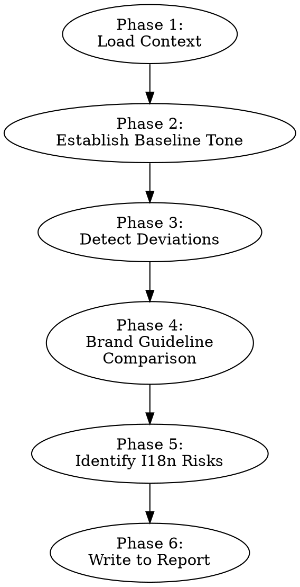

# Auditing I18n Tone

Assess whether a codebase's user-facing copy is consistent in tone and aligned with brand guidelines. Inconsistent tone creates translation problems — translators need a stable source voice to produce a coherent target voice.

Tone fixes are **pre-extraction work** — source copy should be consistent and culturally neutral before extraction. Fixing tone after extraction means re-extracting and re-translating affected strings, so it's cheaper and cleaner to stabilize the source voice first. Replacing idioms, culture-specific references, and inconsistent formality levels now means the extraction agent works with clean, translatable copy.

**Announce at start:** "I'm using the auditing-i18n-tone skill to analyze brand and tone consistency across this codebase's copy."

## When to Use

- Preparing for localization and need to ensure copy consistency before extraction
- Checking if user-facing text matches brand voice guidelines
- Identifying copy that will be problematic to translate (idioms, humor, culture-specific references)
- Assessing whether the app's "voice" is stable enough to localize coherently

**Do not use for:** Scope/string pattern assessment (use auditing-i18n-string-patterns), vocabulary consistency (use auditing-i18n-terminology), or full readiness audit (use auditing-i18n-readiness).

## Scope Constraint

When invoked as a command, arguments are treated as paths to analyze:

```
/auditing-i18n-tone apps/web/src packages/components/src
```

If no paths are provided, analyze the entire repository (excluding test files, build output, node_modules, and other non-source directories). Note the analyzed paths in the report header so readers know the audit's scope.

## Process

Follow these phases in order. Write findings to the "Tone & Brand Analysis" section of `i18n-pre-extraction-fixes.md`. If the file already exists, replace the "Tone & Brand Analysis" section while preserving other sections. If the file does not exist, create it with a report skeleton first, then populate your section.



### Phase 1: Load Context

- Read tech stack and string inventory from `i18n-pre-extraction-fixes.md` (written by auditing-i18n-string-patterns)
- If scope hasn't run, perform lightweight discovery — scan dependency files (package.json, Podfile, build.gradle) to detect the tech stack, then sample up to 20 UI-rendering files to build a working string inventory. This is not a complete inventory — just enough to proceed with tone analysis.
- Search for brand/style guide documents in the repo:
  - `STYLE_GUIDE.md`, `WRITING_GUIDE.md`, `CONTENT_GUIDE.md`
  - `brand-guidelines.*`, `voice-and-tone.*`, `content-style.*`
  - Docs directories: `docs/`, `documentation/`, `design/`, `.github/`
  - Design system docs that include voice/tone guidance

### Phase 2: Establish Baseline Tone Profile

Sample a representative cross-section of user-facing strings. Include strings from different areas: onboarding, core features, settings, error states, empty states, success states.

Characterize the dominant tone along four dimensions:

| Dimension | Spectrum | Indicators |
|-----------|----------|------------|
| **Formality** | Casual ↔ Formal | Contractions ("don't" vs "do not"), sentence structure, vocabulary level |
| **Warmth** | Friendly/Personal ↔ Neutral/Institutional | First/second person ("you", "we"), conversational language, empathy markers |
| **Directness** | Concise/Imperative ↔ Verbose/Explanatory | Sentence length, imperative verbs ("Save" vs "Click here to save your changes"), filler words |
| **Technical level** | Plain language ↔ Jargon-heavy | Domain terms without explanation, acronyms, technical vocabulary |

Present the baseline as: "The app's de facto voice is [formality], [warmth], [directness], [technical level]."

Example: "The app's de facto voice is casual, friendly, concise, and uses plain language — with notable exceptions in error handling and settings."

### Phase 3: Detect Tone Deviations

Scan all user-facing strings for copy that significantly departs from the baseline. Focus on deviations that would create translation inconsistency.

**Common deviation patterns:**

| Pattern | Example | Why it matters |
|---------|---------|---------------|
| Error messages turn harsh | "Invalid input" vs baseline "Oops, that doesn't look right" | Translators need one voice, not two |
| Sudden formality shift | Casual onboarding, then formal settings page | Creates jarring UX in any language |
| Marketing creep | "Supercharge your workflow!" in a functional button | Hyperbole is hard to translate; often sounds worse |
| Passive voice island | "Your file has been uploaded" in an otherwise active app | Inconsistent grammar style |
| Over-explanation | "Click the blue Save button in the top right corner to save your changes" among concise peers | Padding inflates translation costs |
| Terse outliers | "Err" or "Fail" when other messages are friendly | May seem rude in some cultures |

For each deviation, note:
- The specific string and its location
- What the baseline tone would be in that context
- The actual tone observed
- Severity: high (will confuse translators / create inconsistent UX), medium (noticeable), low (minor)

### Phase 4: Brand Guideline Comparison (Conditional)

**If brand/style guide documents were found in Phase 1:**
- Compare the de facto voice (Phase 2 baseline) against documented guidelines
- Flag systematic mismatches, not just individual strings
- Examples:
  - Guidelines say "friendly and approachable" but error messages are "formal and terse"
  - Guidelines say "never use jargon" but settings page is full of technical terms
  - Guidelines specify punctuation rules (no periods on buttons, Oxford comma) that aren't followed

**If no guidelines were found:**
- Note this in the report as a recommendation: "No brand/style guide found. Consider creating one before localizing — translators need voice guidance."
- The de facto voice from Phase 2 becomes the reference standard

### Phase 5: Identify Localization Risks from Tone

Flag tone patterns that create specific translation challenges:

**Humor and wordplay:**
- Puns, jokes, double meanings (rarely translate; often offensive in other cultures)
- Example: "Lettuce begin!" — untranslatable pun

**Idioms and colloquialisms:**
- "Break a leg", "piece of cake", "hit the ground running"
- Culture-specific: "knock on wood", "touch wood" (same concept, different idiom by culture)
- Contractions and informal language vary in acceptability by locale

**Culture-specific references:**
- Sports metaphors ("home run", "goal", "slam dunk")
- Holiday references ("Black Friday deals")
- Social norms ("tipping", "queuing")

**Emotional language:**
- Exclamation marks (enthusiasm in English; shouting in some cultures)
- Superlatives ("the best", "amazing", "incredible") — may seem insincere when translated
- Emoji or emoticon references in copy

For each risk item, suggest a neutral alternative that conveys the same meaning without the translation hazard.

### Phase 6: Write to Report

Append the "Tone & Brand Analysis" section to `i18n-pre-extraction-fixes.md`:

1. **Baseline tone profile:** The four-dimension summary with examples
2. **Brand guideline alignment:** Match/mismatch summary (or note that no guidelines exist)
3. **Deviations table:**

| String | Location | Baseline Tone | Actual Tone | Severity |
|--------|----------|--------------|-------------|----------|
| "INVALID INPUT" | `src/Form.tsx:89` | Friendly, plain | Terse, technical | High |
| "Supercharge your workflow!" | `src/Dashboard.tsx:12` | Concise, plain | Marketing, hyperbolic | Medium |
| ... | ... | ... | ... | ... |

4. **Localization risk items:** Each flagged pattern with the specific string, why it's risky, and a suggested alternative
5. **Recommendations:** Standardize tone before extraction, create brand guidelines if missing, replace risky patterns
6. Contribute items to **Recommended Next Steps**

## Quick Reference

| Phase | What to analyze | Key output |
|-------|----------------|------------|
| 1. Load context | Scope data + brand docs | Working string inventory |
| 2. Baseline | Cross-section of strings | Four-dimension tone profile |
| 3. Deviations | All strings vs baseline | Deviation table with severity |
| 4. Brand guidelines | De facto vs documented voice | Alignment assessment |
| 5. I18n risks | Humor, idioms, culture refs | Risk items with alternatives |
| 6. Report | All findings | Tone & Brand Analysis section |

## Common Mistakes

- **Flagging every minor variation:** Not every slightly different sentence is a deviation. Focus on patterns that would confuse translators or create inconsistent translated UX, not individual word choices.
- **Ignoring error messages:** Error states are where tone breaks down most often. Developers write them under pressure and rarely apply brand voice. Always audit error copy specifically.
- **Treating tone as subjective:** The four-dimension framework (formality, warmth, directness, technical level) makes tone assessment concrete and measurable. Use it consistently.
- **Missing context-appropriate tone shifts:** Some tone variation is intentional and good — a delete confirmation should be more serious than a welcome message. Flag only shifts that seem unintentional or that will create translation problems.
