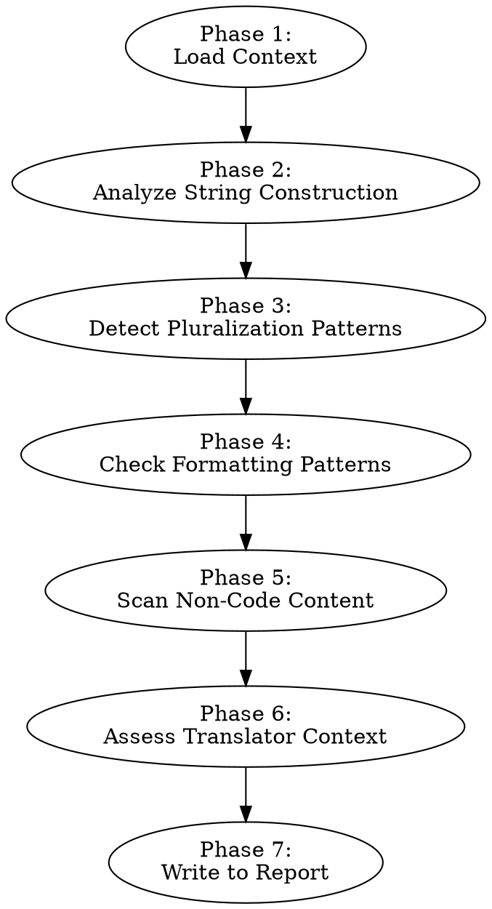

# Auditing L10n Readiness

Identify structural and technical issues in a codebase that will block or complicate localization. These are problems that must be remediated before string extraction can proceed cleanly.

**Announce at start:** "I'm using the auditing-l10n-readiness skill to identify localization blockers in this codebase."

## When to Use

- Assessing what structural issues exist before extracting strings
- Identifying concatenation, pluralization, and formatting problems that break in translation
- Finding non-code localizable content (images with text, CSS content, a11y attributes)
- Evaluating whether translators will have enough context for ambiguous strings

**Do not use for:** Discovering the scope of hardcoded copy (use auditing-l10n-scope), analyzing tone (use auditing-l10n-tone), or checking terminology consistency (use auditing-l10n-terminology).

## Process

Follow these phases in order. Write findings to the "Readiness Issues" section of `l10n-audit-report.md`. If the file already exists, replace the "Readiness Issues" section while preserving other sections. If the file does not exist, create the full report skeleton first, then populate your section. If the scope skill has already run, consume its tech stack and string inventory. If not, perform a lightweight discovery pass first.



### Phase 1: Load Context

- Check if `l10n-audit-report.md` exists with scope data
- If yes: read tech stack and string inventory from the report
- If no: perform lightweight discovery — scan dependency files (package.json, Podfile, build.gradle) to detect the tech stack, then sample up to 20 UI-rendering files for string patterns. This is not a complete inventory — just enough context to proceed with readiness analysis.

### Phase 2: Analyze String Construction

Scan for patterns that break when translated. Different languages have different word order, grammatical gender, and sentence structure.

**Concatenation (Blocker):**
```
// PROBLEM: word order differs across languages
"Hello, " + userName + "! You have " + count + " new messages."

// German word order: "Hallo, {userName}! Sie haben {count} neue Nachrichten."
// Japanese: "{userName}さん、こんにちは！新しいメッセージが{count}件あります。"
```
Find: `+` operators joining string literals with variables, template literals building sentences from parts, `String.format` with sentence fragments.

**Interpolation with embedded logic (Blocker):**
```
// PROBLEM: many languages have 3-6 plural forms, not just singular/plural
`You have ${count} ${count > 1 ? "items" : "item"} in your cart`
```
Find: ternary operators inside strings that switch on count/quantity.

**Sentence fragments (Warning):**
```
// PROBLEM: assembling sentences from separate strings
const greeting = getGreeting();  // "Good morning"
const message = greeting + ", " + userName;  // Can't reorder
```
Find: variables holding partial sentences that get assembled elsewhere.

**Severity ratings:**
- **Blocker:** Concatenation building sentences, naive pluralization in ternaries — must fix before extraction
- **Warning:** Minor interpolation quirks, assembled fragments — should fix
- **Info:** Unusual patterns worth noting — consider fixing

### Phase 3: Detect Pluralization Patterns

How does the app handle plural forms today?

| Pattern | Assessment |
|---------|------------|
| `count === 1 ? "item" : "items"` | Blocker: English-only plural logic. Arabic has 6 forms, Polish has 4. |
| `if (count === 0) ... else if (count === 1) ... else ...` | Warning: handles zero/one/other but misses many languages |
| Switch on count ranges | Warning: better but still hardcoded rules |
| Using Intl.PluralRules or equivalent | Good: language-aware plural resolution |
| Using i18n library pluralization (ICU `{count, plural, ...}`) | Good: proper ICU plural support |
| No pluralization at all | Info: check if the app displays quantities — if not, non-issue |

Report each pattern found with count of occurrences and example locations.

### Phase 4: Check Formatting Patterns

Scan for hardcoded locale-sensitive formatting:

**Dates:**
- Hardcoded format strings: `MM/DD/YYYY`, `DD.MM.YYYY`
- `toLocaleDateString()` without explicit locale argument (uses system locale — inconsistent)
- `new Date().toISOString()` displayed to users (technical format)
- `DateFormatter` (Swift) or `SimpleDateFormat` (Java/Kotlin) with hardcoded patterns

**Numbers:**
- `toFixed(2)` for currency display (decimal separator varies by locale)
- Manual comma/period insertion for thousands separators
- Hardcoded decimal separators

**Currency:**
- Hardcoded symbols: `$`, `EUR`, `USD` prepended/appended to amounts
- Symbol position varies by locale (`$10` vs `10 $` vs `10$`)

**Measurements:**
- Hardcoded unit labels: "kg", "miles", "inches"

Rate each as blocker (user sees wrong format) or warning (inconsistent but functional).

### Phase 5: Scan Non-Code Content

Find localizable content outside of typical source strings:

**Images and SVGs:**
- Images with embedded text (screenshots, diagrams, marketing banners)
- SVGs with `<text>` elements containing hardcoded strings
- These require asset variants per locale

**CSS content:**
- `content: "..."` in stylesheets (::before, ::after pseudo-elements)
- Often used for decorative text, icons-with-labels, or status indicators

**Accessibility attributes:**
- `aria-label`, `aria-placeholder`, `aria-roledescription`
- `alt` text on images
- `title` attributes on elements
- `contentDescription` in Android XML/Compose
- `accessibilityLabel` in SwiftUI
- These are read aloud by screen readers and must be translated

**Email templates, push notifications, in-app messages:**
- Often in separate template files or backend config
- Easy to miss during a code-focused audit

### Phase 6: Assess Translator Context

Evaluate whether translators will be able to produce good translations from extracted strings:

**Ambiguous strings:**
- Short strings with multiple meanings: "Post" (verb: submit / noun: article), "Set" (verb: configure / noun: collection), "Save" (verb: store / noun: discount)
- Strings that need grammatical context: "New" (masculine? feminine? neuter? depends on language)

**Variable context:**
- Strings with placeholders where the variable's type/meaning isn't obvious: `"Updated {0} ago"` — is `{0}` a time duration? A date? A name?
- Strings where the variable affects grammar: `"Delete {name}?"` — in German, the article before `{name}` depends on the noun's gender

**String isolation:**
- Are strings grouped by feature/screen (good for context) or scattered (bad)?
- Would a translator seeing `"Cancel"` know if it's canceling a subscription, a dialog, or an upload?

### Phase 7: Write to Report

Append the "Readiness Issues" section to `l10n-audit-report.md`:

1. **Summary:** Total issues found, breakdown by severity (blockers / warnings / info)
2. **Issues table:** For each issue category:

| Category | Severity | Count | Example | Remediation |
|----------|----------|-------|---------|-------------|
| String concatenation | Blocker | 23 | `src/Dashboard.tsx:45` | Replace with ICU message format: `{name}, welcome!` |
| Naive pluralization | Blocker | 8 | `src/Cart.tsx:112` | Use ICU plural syntax: `{count, plural, one {# item} other {# items}}` |
| Hardcoded date format | Warning | 12 | `src/Activity.tsx:67` | Use `Intl.DateTimeFormat` with locale param |
| ... | ... | ... | ... | ... |

3. **Effort indicators** per category: small (< 1 day), medium (1-3 days), large (3+ days)
4. Contribute items to **Recommended Next Steps**

## Quick Reference

| Phase | What to find | Severity |
|-------|-------------|----------|
| String construction | Concatenation, fragments, embedded logic | Blocker/Warning |
| Pluralization | Ternary plurals, if/else on count | Blocker |
| Formatting | Hardcoded dates, numbers, currency, units | Blocker/Warning |
| Non-code content | Images with text, CSS content, a11y attrs | Warning |
| Translator context | Ambiguous strings, unclear variables | Warning/Info |

## Common Mistakes

- **Ignoring "minor" concatenation:** Even `"Welcome, " + name` is a problem — in Japanese the name comes first. Every concatenation that builds a sentence is a blocker.
- **Assuming English plural rules:** English has 2 forms (singular/plural). Arabic has 6. Polish has 4. Chinese has 1. The ternary `count === 1 ?` pattern fails for most languages.
- **Missing CSS content:** `content: "..."` in pseudo-elements is invisible in typical string searches but visible to users.
- **Overlooking accessibility strings:** Screen reader users in other locales need translated `aria-label` and `alt` text. These are first-class localizable content.
